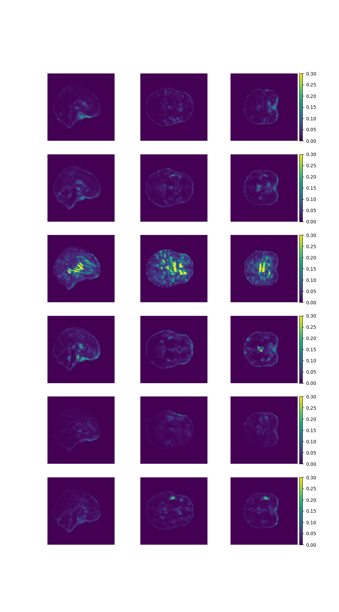

# Data Augmentation Comparison

Comparison of brain age saliency maps generated from different augmentation methods.

### Introduction
Saliency maps can offer insights into CNNs’ decision-making. We compare 4 augmentation methods that allow us to gain insight into the traditionally black box setting of CNNs, and to understand how CNNs learn MRIs of the brain.

### Methods

We trained 3D CNN networks to predict chronological age of the participant using T1-weighted MRI brain scans. The training data was augmentated using, 
1. gaussian blur, 
2. rotation, 
3. translation, and 
4. scaling.

We compared the saliency maps quantitatively using Dice, NMI, MSE and SSIM. The quantitative measures were computed between the generated saliency map and the raw MRI brain scan. This allowed us to measure how closely the saliency maps replicate the MRI scan features.

### Results

Saliency map figure 

|                   |     Mean   Structural Similarity Index    |     Mean   Square Error    |     Normalized   Mutual Information    |     Dice   Coefficient    |
|-------------------|-------------------------------------------|----------------------------|----------------------------------------|---------------------------|
|     Normal        |     0.8228±0.0035                         |     0.0976±0.0029          |     1.0000±0.0000                      |     0.0004±0.0002         |
|     Duplicated    |     0.8221±0.0035                         |     0.0977±0.0029          |     1.0000±0.0000                      |     0.0001±0.0000         |
|     Blurred       |     0.8222±0.0036                         |     0.0970±0.0029          |     1.0040±0.0014                      |     0.0168±0.0057         |
|     Rotated       |     0.8220±0.0036                         |     0.0977±0.0029          |     1.0000±0.0000                      |     0.0013±0.0007         |
|     Translated    |     0.8230±0.0035                         |     0.0976±0.0029          |     1.0000±0.0000                      |     0.0001±0.0000         |
|     Scaled        |     0.8218±0.0036                         |     0.0976±0.0029          |     1.0000±0.0000                      |     0.0003±0.0003         |

|                   |     Validation MAE   (years)    |     Test MAE   (years)    |
|-------------------|---------------------------------|---------------------------|
|     Normal        |     4.90                        |     13.57                 |
|     Duplicated    |     4.68                        |     13.43                 |
|     Blurred       |     4.74                        |     14.08                 |
|     Rotated       |     4.62                        |     13.01                 |
|     Translated    |     4.51                        |     11.37                 |
|     Scaled        |     4.69                        |     12.94                 | 

### Conclusion
Rotation, translation, and scaling are all viable data augmentation methods that can increase the accuracy of this specific 3D CNN model without disrupting typically observed saliency.